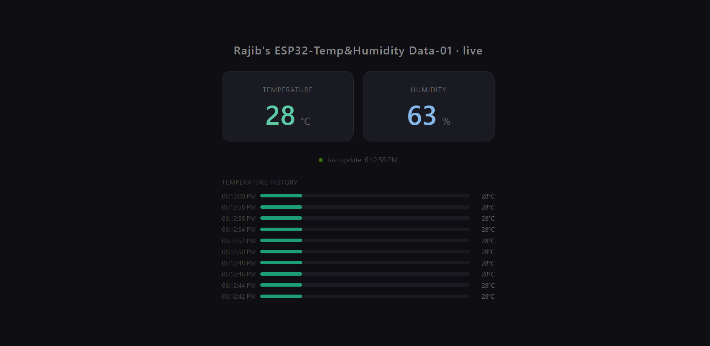

# 🌡️ ESP32 Freezer Dashboard

> A full-stack IoT system that reads real-world temperature and humidity from a physical sensor, transmits the data over WiFi using the MQTT protocol, processes it through a Node.js backend, and displays it live on a browser dashboard — accessible from anywhere in the world.

**Built by:** Ahmed Ragib Hasan  
**Stack:** Embedded C++ · ESP32 · MQTT · Node.js · Express · HTML/CSS/JS  
**Status:** 🟢 Live

---

## 📸 Demo

Check Out the [Live Dashboard](https://esp32-temp-humidity-freezermonitor-dashboard-production.up.railway.app/)


> 

---

## 🗺️ System Architecture

```
┌─────────────────────────────────────────────────────────────┐
│                     HARDWARE LAYER                          │
│                                                             │
│   DHT11 Sensor  ──(signal)──▶  ESP32-WROOM-32              │
│   (temp + humidity)            (reads, builds JSON)         │
└─────────────────────────┬───────────────────────────────────┘
                          │ WiFi (MQTT publish)
                          ▼
┌─────────────────────────────────────────────────────────────┐
│                     BROKER LAYER                            │
│                                                             │
│              broker.hivemq.com                              │
│              Topic: jojo/freezer/sensors                    │
└─────────────────────────┬───────────────────────────────────┘
                          │ MQTT subscribe
                          ▼
┌─────────────────────────────────────────────────────────────┐
│                     BACKEND LAYER                           │
│                                                             │
│              Node.js + Express (Railway)                    │
│              Subscribes → stores → serves REST API          │
└─────────────────────────┬───────────────────────────────────┘
                          │ HTTP GET /api/latest
                          ▼
┌─────────────────────────────────────────────────────────────┐
│                     FRONTEND LAYER                          │
│                                                             │
│              Browser Dashboard (HTML/CSS/JS)                │
│              Live temp · humidity · history bars            │
└─────────────────────────────────────────────────────────────┘
```

---

## 🛠️ Tech Stack

### Hardware
| Component | Role |
|---|---|
| ESP32-WROOM-32 | Microcontroller — reads sensor, connects to WiFi, publishes MQTT |
| DHT11 sensor | Measures temperature (°C) and humidity (%) |
| 10kΩ resistor | Pull-up resistor between VCC and DATA on DHT11 |
| Breadboard + jumper wires | Circuit prototyping |

### Firmware (Embedded C++)
| Library | Role |
|---|---|
| `DHT.h` (Adafruit) | Reads temperature and humidity from DHT11 |
| `ArduinoJson` | Serialises sensor data into JSON strings |
| `WiFi.h` | Connects ESP32 to home WiFi |
| `PubSubClient` | MQTT client — publishes JSON to broker |
| PlatformIO | Build system and IDE toolchain (VS Code extension) |

### Backend (Node.js)
| Package | Role |
|---|---|
| `mqtt` | Subscribes to MQTT broker, receives ESP32 messages |
| `express` | HTTP server — exposes REST API endpoints |

### Frontend
| Technology | Role |
|---|---|
| HTML/CSS/JS | Dashboard UI — no framework, vanilla only |
| `fetch()` + `setInterval` | Polls `/api/latest` every 2 seconds |
| CSS animations | Pulsing live indicator dot |

### Infrastructure
| Service | Role |
|---|---|
| HiveMQ (public broker) | Free MQTT broker — routes messages between ESP32 and backend |
| Railway | Cloud hosting for Node.js backend |
| GitHub | Version control + Railway deployment trigger |

---

## 📡 Data Flow Explained

The ESP32 reads the DHT11 sensor every 2 seconds and builds a JSON payload:

```json
{
  "device": "freezer-01",
  "temp_c": 28,
  "humidity": 63,
  "uptime_s": 619
}
```

This string is published via MQTT to the topic `jojo/freezer/sensors` on `broker.hivemq.com`.

The Node.js backend maintains a persistent MQTT subscription to the same topic. When a message arrives, it parses the JSON, adds a server-side `received_at` timestamp, and stores it in a circular in-memory buffer (last 20 readings).

The browser dashboard calls `GET /api/latest` every 2 seconds via `fetch()` and updates the DOM with the new values.

---

## 🚀 Getting Started

### Prerequisites
- [Node.js](https://nodejs.org) v18+
- [PlatformIO](https://platformio.org) (VS Code extension)
- ESP32-WROOM-32 board
- DHT11 sensor + 10kΩ resistor + breadboard

### Hardware Wiring

| DHT11 Pin | ESP32 Pin | Wire |
|---|---|---|
| VCC | 3.3V | Red |
| GND | GND | Black |
| DATA | GPIO 15 | Yellow |

> ⚠️ Use **3.3V**, not 5V. ESP32 GPIO is 3.3V logic — feeding 5V can damage the chip.  
> ⚠️ The bare DHT11 (4-pin) requires a 10kΩ pull-up resistor between VCC and DATA.

### Firmware Setup

1. Clone this repo and open the `esp-freezer-sensor` folder in VS Code with PlatformIO
2. Edit `src/main.cpp` — fill in your WiFi credentials:

```cpp
#define WIFI_SSID   "YourWiFiName"
#define WIFI_PASS   "YourWiFiPassword"
```

3. Connect ESP32 via USB
4. Click **Upload** in PlatformIO
5. Hold the **BOOT** button on the ESP32 when you see `Connecting.......` in the terminal
6. Open Serial Monitor at 115200 baud — you should see JSON printing every 2 seconds

### Backend Setup

```bash
cd esp-freezer-backend
npm install
node server.js
```

Open `http://localhost:3000` to see the dashboard locally.

### Deploy to Railway

```bash
git init
git add .
git commit -m "initial commit"
git remote add origin gitrepo-url (exm https://github.com/YOUR_USERNAME/freezer-dashboard.git)
git push -u origin main
```

Then connect the repo to [Railway](https://railway.app) and generate a public domain.

---

## 📁 Project Structure

```
esp-freezer-backend/
├── public/
│   └── index.html        # Dashboard UI — HTML/CSS/JS
├── server.js             # Node.js backend — MQTT subscriber + REST API
├── package.json          # Dependencies and start script
└── .gitignore

esp-freezer-sensor/       # Separate PlatformIO project
├── src/
│   └── main.cpp          # ESP32 firmware
└── platformio.ini        # Board config + library dependencies
```

---

## 🔌 API Reference

| Endpoint | Method | Response |
|---|---|---|
| `/api/latest` | GET | Single most recent sensor reading |
| `/api/history` | GET | Array of last 20 readings |

**Example response from `/api/latest`:**
```json
{
  "device": "freezer-01",
  "temp_c": 28,
  "humidity": 63,
  "uptime_s": 619,
  "received_at": "2026-05-03T08:16:09.911Z"
}
```

---

## 🧠 What I Learned

This project was built as a learning exercise covering the full IoT stack from hardware to cloud. Key concepts encountered:

**Embedded Systems**
- How microcontrollers use `setup()` and `loop()` execution model
- 3.3V vs 5V logic levels and why they matter
- Pull-up resistors and why sensors need them
- How `#define`, `float`, `char[]` and manual memory allocation work in C++
- Using PlatformIO as a professional alternative to Arduino IDE
- Flashing firmware and using Serial Monitor for hardware debugging

**Networking & Protocols**
- How MQTT's publish/subscribe model differs from HTTP request/response
- Why IoT devices use MQTT instead of HTTP (persistent connection, low overhead)
- How protocols layer on top of each other (WiFi → TCP → MQTT)
- The role of a broker in routing messages between devices
- How JSON travels unchanged from a C++ char array to a JavaScript object

**Backend (Node.js)**
- Setting up an Express server with static file serving
- Using the `mqtt` npm package to subscribe to a broker
- In-memory circular buffers for time-series data
- `process.env.PORT` pattern for cloud deployment compatibility

**Frontend**
- Polling an API with `setInterval` + `fetch()`
- Dynamic DOM updates without a framework
- Building a responsive bar chart with pure CSS width percentages

**DevOps**
- Git workflow — init, add, commit, push
- Deploying a Node.js app to Railway from GitHub
- Environment variables in cloud deployments

---

## 🔮 Future Possibilities

These are planned or possible upgrades to explore next:

- [ ] **WebSockets** — replace polling with `socket.io` so updates are pushed instantly instead of fetched every 2 seconds
- [ ] **Database** — store all readings in PostgreSQL or InfluxDB (time-series database) so history persists after server restart
- [ ] **Alerts** — send a WhatsApp or email notification when temperature exceeds a threshold (e.g. using Twilio or Nodemailer)
- [ ] **Multiple devices** — add a second sensor with a different `device` ID and display both on the same dashboard
- [ ] **Authentication** — add a login so only your friends with a password can see the dashboard
- [ ] **Mobile app** — build a React Native app that consumes the same `/api/latest` endpoint
- [ ] **OTA updates** — update the ESP32 firmware over WiFi without plugging in a USB cable
- [ ] **Battery powered** — use deep sleep mode on ESP32 to run the sensor on a battery for months
- [ ] **Private MQTT broker** — replace the public HiveMQ broker with a self-hosted Mosquitto instance for security

---


## 📄 License

MIT — free to use, modify and share.

---

*Built in Dhaka, Bangladesh 🇧🇩 — May 2026*
